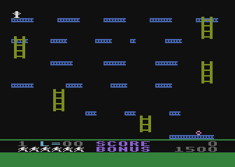
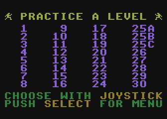
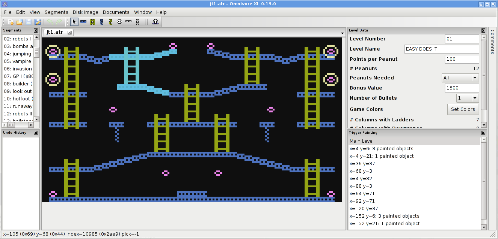

.. _jumpman:

.. include:: <isopub.txt>

====================================================
Jumpman: Reverse Engineering the Atari 8-bit Version
====================================================

.. raw:: html
   
    

`Kay Savetz <http://ataripodcast.com>`_ and I have started reverse
engineering the Atari 8-bit version of `Jumpman <http://www.atarimania.com/game-atari-400-800-xl-xe-jumpman_2713.html>`_.

Here is the latest version of our `reverse engineering notes <http://playermissile.com/jumpman/notes.html>`_.

We are striving to reverse engineer the assembly code so that we can understand the custom code that is present in most levels. Further in the future, we would like to create a build system such that we can create a byte-exact copy of the binary image from source.

.. note::

   Enter the **JUMPMAN LEVEL DESIGN CONTEST!** Kay and I invite you to create
   new Jumpman levels using the `level editor in Omnivore
   <http://playermissile.com/omnivore>`_ and enter them in our contest. We will
   pick the best 32 levels and use them to create an entirely new edition of
   Jumpman!

   You can post them `on the forum 
   <http://atariage.com/forums/topic/255262-jumpman-level-design-contest/>`_,
   or if you'd rather submit them privately you can email them to me at
   feedback at playermissile dot com.

   There is no deadline at this point, we want to give you time to check out
   the new capabilities of Omnivore to create custom levels.

Level Editor
============

`Omnivore <http://playermissile.com/omnivore>`_ now includes a level editor!

It's a full GUI-based editor with a point-and-click interface to drawing and erasing elements. It was formally announced `KansasFest 2016 <http://kansasfest.org>`_.

.. note:: Now including a 6502 assembler for development of levels
   with custom code!

You can watch Kay's demonstration on `how to use the editor <https://www.youtube.com/watch?v=d_KhNS8nk70>`_ on YouTube.

Quick Start For Basic Levels
----------------------------

Download Omnivore for `Windows or Mac OS here <https://github.com/robmcmullen/omnivore/releases>`_.

Open Omnivore and choose ``File -> New -> Jumpman Level`` and you'll see a very
simple level definition. You can add to that by clicking one of the draw icons
in the toolbar and drawing in the main window. By clicking on the arrow icon in
the toolbar you can select existing items and drag them around; you can cut,
copy and paste the selected items, and more. Change the level settings like the
level name and number of bullets in the right hand panel.

Tips:

* Only one bomb per grid square
* Use ramps that slope up or down by only one pixel per block

Girders can be placed at any position, but note that Jumpman can only
fearlessly navigate the horizontal girders and ramps that are sloped up or down
by one pixel per block. Ramps that slope up more than that can be (carefully)
climbed, but down-slopes of more than one pixel will trip up and kill poor
Jumpman. It's not recommended to use more than one pixel slope up or down, but
I have left the feature in the editor just in case someone comes up with a use
for it.

Ladders can only be placed at even pixel columns (as measured from the left
side), and are further limited in that only 12 unique columns can be used.
Ladders can be placed above and below one another in the same column without
counting against the 12 column limit. The number of columns of ladders is shown
in the ``Level Data`` window.

Downropes can likewise only be placed at even pixel columns, and are limited to
6 unique column positions. As with ladders, multiple downropes can be placed in
the same column without counting against that limit. The number of downropes is
also shown in the ``Level Data`` window.

Upropes are not limited in either pixel columns or number of unique column
positions, so knock yourself out.

The object of the game is to collect bombs, so be sure to place at least one
bomb or the level will end immediately when you try to play it. When you place
bombs, you'll notice a grid that appears in the main window. Thick red borders
between each grid cell denotes invalid bomb locations, so place bombs only
where they don't touch any of the red cell borders. (Due to a speed
optimization in the code, the game can crash when Jumpman collects a bomb that
is touching any part of the red shaded area.) Only one bomb may be placed per
grid square.

Finally, you must set Jumpman's respawn position by selecting the the Jumpman
figure icon on the toolbar. Place the white square at the desired location.
Typically, Jumpman will be placed on a girder, but other starting positions are
possible. If the bottom of the square overlaps a girder, Jumpman will climb up.
Note that Jumpman must not fall more than one pixel; more than that results in
death.

To playtest your level: choose ``File -> Save As``, give it a filename with the
``.atr`` extension, and run it in your favorite emulator. You can also set up
Omnivore to run an emulator directly when you press F5; go to the ``Disk Image
-> Emulators -> Edit Emulators...`` entry to set up the emulator for your
platform.

For more complicated levels, Jumpman has a feature where it will draw new items
or erase existing ones when you collect a bomb. To create a level using this
feature, use the ``Trigger Painting`` panel to select one of the bombs (they
are listed by their x and y coordinates). The level will fade into the
background and you can paint more items in the main window. Everything you draw
(or erase) here will only get triggered when Jumpman collects that bomb. You
can even cascade triggers by adding more bombs and selecting the new bombs in
the trigger painting panel. Bombs will be indented to show the parent/child
relationship when there are multiple levels of nesting. Select the ``Main
Level`` entry to paint on the normal level definition.

Advanced Levels With Custom Code
--------------------------------

Omnivore now has in integrated `MAC/65 compatible
<http://mixinc.net/atari/mac65.htm>`_ assembler that recognizes specific
keywords in your assembly code and puts them in the correct spots in your
Jumpman level definition.

You will need to edit the assembly source with your favorite text editor and
then use the ``Jumpman -> Custom Code...`` menu item to add the source file to
your level. After that it will remember the file when you load the level again.
Be sure the source code is in the same directory as the .atr image. If you move
the .atr file to a new place, be sure to copy your assembly file as well.

The assembler recognizes certain labels in your assembly code. If any start
with ``trigger``, those labels will be available as targets for peanut
collection. You can right click on peanuts and set their trigger function to
any of those in the list.

There are special vectors that Omnivore knows about; see the section in the
`Jumpman Reverse Engineering Notes
<http://playermissile.com/jumpman/notes.html#h.s0ullubzr0vv>`_.

If you give your code any of those labels:

* vbi1
* vbi2
* vbi3
* vbi4
* dead_begin
* dead_at_bottom
* dead_falling
* out_of_lives
* level_complete
* collect_callback

then Omnivore will put the vector for your subroutine in the right place in the
level definition so that your routine gets automatically called. See the
reverse engineering notes for more details on what each of the labels means.

There's also one last special label: ``gameloop``. If you define this in your
code, it will take over the non-VBI main game loop. If you don't define it,
Omnivore will put the standard game loop at $2860. The game loop is responsible
for fading in jumpman at the beginning of a level and monitoring end-of-game
conditions. Only a few examples of a custom game loop exist Glover's original
levels, so this is not a commonly used feature at all.

Disassembly
===========

If you're interested in exploring the assembly code in Jumpman, you'll want to
use the standard Jumpman disk image and then get the Omnivore metadata file
that provides the comments.

* `Jumpman disk image <http://www.atarimania.com/game-atari-400-800-xl-xe-jumpman_2713.html>`_
* `latest metadata <http://playermissile.com/jumpman/Jumpman%20(1983)(Epyx)(US)[!].atr.omnivore>`_

Note that Omnivore recognizes a Jumpman disk image and loads right into the
level editor. To use the hex editor, you'll need to use the menu option
``Window -> New View of Jumpman -> In Hex Editor Window``

Forum Posts
===========

* `Jumpman Level Design Contest <http://atariage.com/forums/topic/255262-jumpman-level-design-contest/>`_

* `Jumpman Hacking <http://atariage.com/forums/topic/252267-jumpman-hacking>`_ - Kay's new levels!

  * `Play The Demo <http://atariage.com/forums/topic/252267-jumpman-hacking/#entry3505130>`_
  * `Welcome Back <http://atariage.com/forums/topic/252267-jumpman-hacking/#entry3505464>`_ - the first new level in 33 years!

* `Jumpman: Practice any level <http://atariage.com/forums/topic/252645-jumpman-practice-any-level/>`_ - my first coding hack of Jumpman, with an additional menu screen to play any level

Resources
=========

* `Interview with Randy Glover <http://ataripodcast.libsyn.com/antic-interview-171-randy-glover-jumpman>`_ **Listen to us talk to the creator of Jumpman!**

* `Jumpman <http://www.atarimania.com/game-atari-400-800-xl-xe-jumpman_2713.html>`_ - the disk image that we used as the basis of our hacking
* `Jumpman #1 <http://www.atarimania.com/game-atari-400-800-xl-xe-jumpman-1_21842.html>`_ - we think this is the demo version that Randy Glover took to show Brøderbund and Epyx
* `Jumpman Junior <http://www.atarimania.com/game-atari-400-800-xl-xe-jumpman-junior_2714.html>`_ - The cartridge with 12 different levels

Similar Projects
================

* `Jumpman Lounge fan site <http://archive.kontek.net/jlounge.classicgaming.gamespy.com/guide.html>`_
* `Reverse-engineered source code for PC version <http://www.oldskool.org/pc/jumpman/>`_. Includes a level editor
* `Jumpman Under Construction <http://members.iinet.net.au/~cleathley/jumpman/>`_
* `Jumpman Lives <http://www.classicdosgames.com/game/Jumpman_Lives!.html>`_ unauthorized clone?
* `Jumpman Forever <http://www.jumpmanforever.com/>`_ Kickstarted project on modern hardware
* `C64 Jumpman Level Editor <http://www.lemon64.com/forum/viewtopic.php?t=61025>`_ Newly started project on the C64 version of Jumpman, inspired by our work on the Atari version!

Publicity
=========

* `Retro Revisited: Jumpman <https://www.vintageisthenewold.com/retro-revisited-jumpman/>`_

