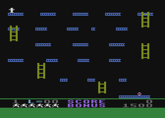
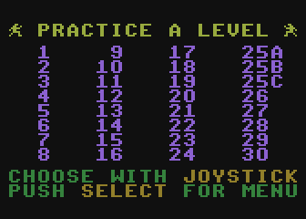
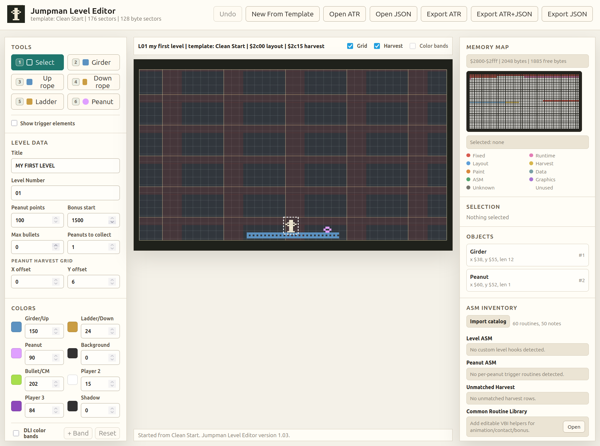

.. _jumpman:

.. include:: <isopub.txt>

====================================================
Jumpman: Reverse Engineering the Atari 8-bit Version
====================================================

.. raw:: html

    

`Kay Savetz <http://ataripodcast.com>`_ and I have started reverse
engineering the Atari 8-bit version of `Jumpman <http://www.atarimania.com/game-atari-400-800-xl-xe-jumpman_2713.html>`_.

Here is the latest version of our `reverse engineering notes <http://playermissile.com/jumpman/notes.html>`_.

We are striving to reverse engineer the assembly code so that we can understand the custom code that is present in most levels. Further in the future, we would like to create a build system such that we can create a byte-exact copy of the binary image from source.

.. note::

   Enter the **JUMPMAN LEVEL DESIGN CONTEST!** Kay and I invite you to create
   new Jumpman levels using the web-based `level editor
   <https://www.savetz.com/jumpman>`_ and enter them in our contest. We will
   pick the best 32 levels and use them to create an entirely new edition of
   Jumpman!

   You can post them `on the forum
   <http://atariage.com/forums/topic/255262-jumpman-level-design-contest/>`_,
   or if you'd rather submit them privately you can email them to me at
   feedback at playermissile dot com.

Level Editor
============

The Omnivore level editor has been retired, and a new web-based editor has taken
its place: `https://www.savetz.com/jumpman <https://www.savetz.com/jumpman>`_

Being web-based, it's available on any platform. It can manage all the features of Jumpman,
including drawing and erasing elements, sprite creation, music and sound effect
generation, and more. It includes a library of levels that you can use as a starting point,
and includes an assembler to enable you to add custom code.

You can watch Kay's demonstration on `how to use the editor <https://youtu.be/M_dkTRfgCRs>`_ on YouTube.

Forum Posts
===========

* `Jumpman Level Design Contest <http://atariage.com/forums/topic/255262-jumpman-level-design-contest/>`_

* `Jumpman Hacking <http://atariage.com/forums/topic/252267-jumpman-hacking>`_ - Kay's new levels!

  * `Play The Demo <http://atariage.com/forums/topic/252267-jumpman-hacking/#entry3505130>`_
  * `Welcome Back <http://atariage.com/forums/topic/252267-jumpman-hacking/#entry3505464>`_ - the first new level in 33 years!

* `Jumpman: Practice any level <http://atariage.com/forums/topic/252645-jumpman-practice-any-level/>`_ - my first coding hack of Jumpman, with an additional menu screen to play any level

Resources
=========

* `Interview with Randy Glover <http://ataripodcast.libsyn.com/antic-interview-171-randy-glover-jumpman>`_ **Listen to us talk to the creator of Jumpman!**

* `Jumpman <http://www.atarimania.com/game-atari-400-800-xl-xe-jumpman_2713.html>`_ - the disk image that we used as the basis of our hacking
* `Jumpman #1 <http://www.atarimania.com/game-atari-400-800-xl-xe-jumpman-1_21842.html>`_ - we think this is the demo version that Randy Glover took to show Brøderbund and Epyx
* `Jumpman Junior <http://www.atarimania.com/game-atari-400-800-xl-xe-jumpman-junior_2714.html>`_ - The cartridge with 12 different levels

Similar Projects
================

* `Jumpman Lounge fan site <http://archive.kontek.net/jlounge.classicgaming.gamespy.com/guide.html>`_
* `Reverse-engineered source code for PC version <http://www.oldskool.org/pc/jumpman/>`_. Includes a level editor
* `Jumpman Under Construction <http://members.iinet.net.au/~cleathley/jumpman/>`_
* `Jumpman Lives <http://www.classicdosgames.com/game/Jumpman_Lives!.html>`_ unauthorized clone?
* `Jumpman Forever <http://www.jumpmanforever.com/>`_ Kickstarted project on modern hardware
* `C64 Jumpman Level Editor <http://www.lemon64.com/forum/viewtopic.php?t=61025>`_ Newly started project on the C64 version of Jumpman, inspired by our work on the Atari version!

Publicity
=========

* `Retro Revisited: Jumpman <https://www.vintageisthenewold.com/retro-revisited-jumpman/>`_
